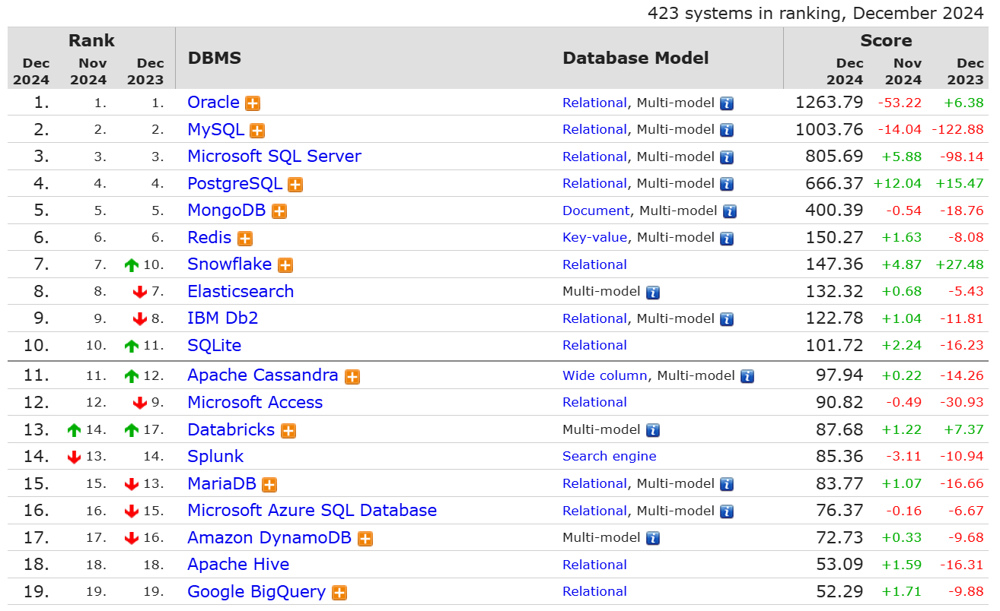

---
ShareButtons:
- linkedin
- whatsapp
- twitter
ShowReadingTime: true
date : '2024-12-03T11:51:25+07:00'
draft: false
tags:
- database
- oracledb
- mysql
- postgres
- sql server
title : 'Database level use'
---


Level database biasanya merujuk pada level di mana database beroperasi dalam infrastruktur atau aplikasi

Ranking database desember 2024 



Source : [Database Ranking](https://db-engines.com/en/ranking)

```go

+------------------+-----------------------------------------------+-------------------------+
| DATABASE         | BEST USE CASES                                | LEVEL                   |
+------------------+-----------------------------------------------+-------------------------+
| Oracle Database  | Mission-critical apps, ERP, data warehousing  | Enterprise (High-tier)  |
+------------------+-----------------------------------------------+-------------------------+
| MySQL            | Web apps, CMS, e-commerce                     | Mid-tier to lightweight |
+------------------+-----------------------------------------------+-------------------------+
| PostgreSQL       | Analytics, hybrid SQL + NoSQL, data warehouse | Enterprise to mid-tier  |
+------------------+-----------------------------------------------+-------------------------+
| SQL Server       | Microsoft ecosystem, BI, transactional apps   | Enterprise (Mid to High)|
+------------------+-----------------------------------------------+-------------------------+
| MongoDB          | NoSQL, scalable apps, flexible schemas        | Mid-tier to startup     |
+------------------+-----------------------------------------------+-------------------------+
| MariaDB          | Web apps, SaaS, e-commerce                    | Mid-tier                |
+------------------+-----------------------------------------------+-------------------------+
| SQLite           | Mobile apps, embedded systems                 | Lightweight             |
+------------------+-----------------------------------------------+-------------------------+
