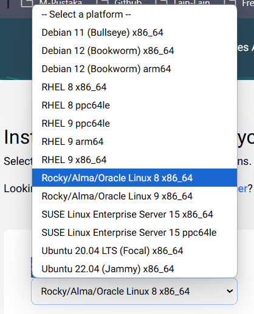
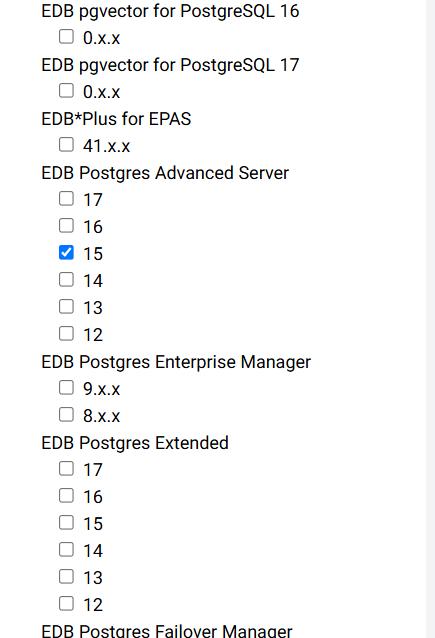
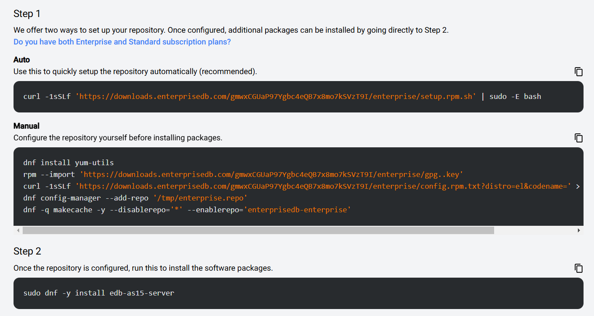

---
ShareButtons:
- linkedin
- whatsapp
- twitter
ShowReadingTime: true
tags:
- database
- edb
- postgres

date : 2025-02-17T13:11:53+07:00
draft : false
title : Edb Postgres Installation
---


1. Get repor from EDB

    [here](https://www.enterprisedb.com/repos)

2. Select platform and verison edb

    platform:
    

    version edb:
    
3. Then will show step how to installation
    

4. Run script in the terminal

    Get repo auto:
    ```go
    curl -1sSLf 'https://downloads.enterprisedb.com/gmwxCGUaP97Ygbc4eQB7x8mo7kSVzT9I/enterprise/setup.rpm.sh' | sudo -E bash
    ````

    install edb
    ```go
    sudo dnf -y install edb-as15-server
    ```

5. create /pgadata for data directory

    ```go
    mkdir /pgdata
    chown enterprisedb:enterprisedb /pgdata 
    ```

6. initiate EDB database

    ```go
    su - enterprisedb
    /usr/edb/as15/bin/initdb -D /pgdata 
    ```

7. Change edb-as-15.service parameter 

    ```go
    cd /lib/systemd/system 

    vi /lib/systemd/system/edb-as-15.service
    ```
    
    type this:
    ```go   
    vi edb-as-15.service; cat edb-as-15.service 

    # It's not recommended to modify this file in-place, because it will be 
    # overwritten during package upgrades.  If you want to customize, the 
    # best way is to create a file "/etc/systemd/system/edb-as-15.service", 
    # containing 
    #       .include /lib/systemd/system/edb-as-15.service 
    #       ...make your changes here... 
    # For more info about custom unit files, see 
          
    
    PT ANTAM Tbk-Instalasi EDB Advanced Server 15                                                                                                                     19 
    # 
    http://fedoraproject.org/wiki/Systemd#How_do_I_customize_a_unit_file.2F_add_a_cust
    om_unit_file.3F 
    
    # Note: changing PGDATA will typically require adjusting SELinux 
    # configuration as well. 
    
    [Unit] 
    Description=EDB Postgres Advanced Server 15 
    After=syslog.target network.target 
    
    [Service] 
    Type=notify 
    
    User=enterprisedb 
    Group=enterprisedb 
    
    # Location of database directory 
    #Environment=PGDATA=/var/lib/edb/as15/data 
    #PIDFile=/var/lib/edb/as15/data/postmaster.pid 
    Environment=PGDATA=/pgdata 
    PIDFile=/pgdata/postmaster.pid 
    
    # Where to send early-startup messages from the server (before the logging 
    # options of postgresql.conf take effect) 
    # This is normally controlled by the global default set by systemd 
    # StandardOutput=syslog 
    
    # Disable OOM kill on the postmaster 
    OOMScoreAdjust=-1000 
    
    ExecStartPre=/usr/edb/as15/bin/edb-as-15-check-db-dir ${PGDATA} 
    ExecStart=/usr/edb/as15/bin/edb-postgres -D ${PGDATA} 
    ExecReload=/bin/kill -HUP $MAINPID 
    KillMode=mixed 
    KillSignal=SIGINT 
    
    # Give a reasonable amount of time for the server to start up/shut down 
    TimeoutSec=300 
    
    [Install] 
    WantedBy=multi-user.target 
    ```

8. Change postgresql.conf parameter

    ```go
     vi /pgdata/postgresql.conf | grep edb_redwood_edb_redwood_date = off
    ```

9. Restart daemon and EDB service 

    ```go
    systemctl daemon-reload 
    systemctl stop edb-as-15 
    systemctl start edb-as-15 
    ```