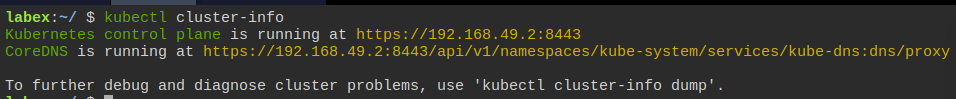
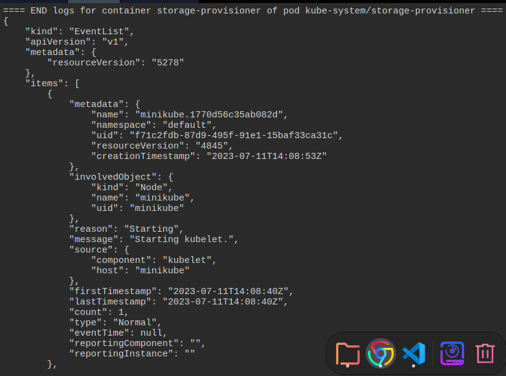

---
ShareButtons:
- linkedin
- whatsapp
- twitter
ShowReadingTime: true
date: "2023-07-11T20:58:18+07:00"
draft: false
tags:
- kubernetes
- docker
title: Kubernetes Beginner
---

### **Display Cluster Info**

1. Get The Kubernetes Cluster Information

    To get the Kubernetes cluster information, use the following command:
    ```
    kubectl cluster-info
    ```
    This command displays the Kubernetes cluster's API server endpoint and the Kubernetes version:

    

2. Get The Kubernetes Components Information 
    To get the Kubernetes components' information, use the following command:
    ```
    kubectl cluster-info dump
    ```
    This command displays detailed information about the Kubernetes components, including etcd, kube-apiserver, kube-controller-manager, kube-scheduler, and other Kubernetes system components.

    
    
    we explored the cluster-info command, which provides information about the Kubernetes cluster. We learned how to get the Kubernetes cluster information, components information, services information, nodes information, pods information, events information, endpoints information, storage classes information, and persistent volumes information. By using these commands, you can get a better understanding of the Kubernetes cluster's state and diagnose issues in the cluster.

### **Examine Nodes with Kubectl**

Basic Node Information

The first thing you will do is get basic information about the nodes in your cluster.

1. To view a list of nodes in your cluster, run the following command :

    ```
    kubectl get nodes
    ```

2. To get more detailed information about a specific node, run the following command:

    ```
    kubectl describe node minikube
    ```

3. Labels and Annotations

    Labels and annotations can be used to add metadata to nodes in your cluster. This metadata can be used to select nodes for specific tasks or to filter nodes based on certain criteria.

    - This will display the labels and annotations for the specified node, run the following command:
          ```
          kubectl get node minikube --show-labels=true
          ```
    - To add a label to a node, run the following command:
          ```
          kubectl label node minikube org=labex
          ```
    - To add an annotation to a node, run the following command:
          ```
          kubectl annotate node minikube environment=production
          ```
    - Use the following command to check the labels on the node:
          ```
          kubectl get nodes --show-labels
          ``` 
    - This will output a list of all the nodes in the cluster along with their labels,Nodes can be labeled to help identify their purpose or characteristics.

### **Kubernetes Client and Server Version**
### **Running Containers in Pods**
### **Scaling and Managing Pods with Deployments**
