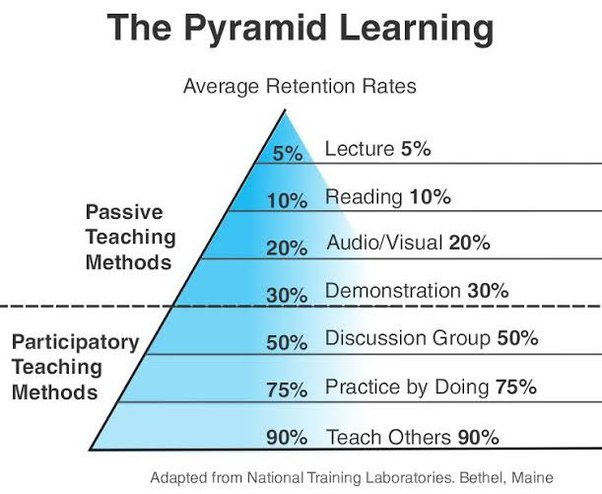

---
ShareButtons:
- linkedin
- whatsapp
- twitter
ShowReadingTime: true
date: "2023-09-12T19:34:25+07:00"
draft: false
tags:
- me
title: Learn by Doing
---

Berdasarkan artikel" yang saya baca & pengalaman saya dalam belajar:

Ada 2 tahapan dalam belajar: INPUT & OUTPUT.

Misalkan, Anda ingin belajar ber-sepatu roda,

Anda melihat tutorial ber-sepatu roda di YouTube (INPUT).

Setelah melihat tutorial" di YouTube, Anda mem-praktek-kan-nya (OUTPUT).

Ketika Anda mem-praktek-kan-nya, Anda membuat kesalahan: Beberapa kali kehilangan keseimbangan & jatuh.

Anda berusaha menganalisa kesalahan" tersebut, sehingga Anda tidak terjatuh lagi.

Semakin sering Anda mem-praktek-kan apa yang Anda pelajari, semakin cepat Anda menguasai skill ini.

Berdasarkan penelitian, kalau kita hanya MEMBACA, kita hanya akan mengingat 10% dari apa yang kita baca.

Tapi, kalau kita mem-praktek-kan apa yang kita baca, kita akan mengingat 75% dari apa yang kita baca.

Therefore people say: THE BEST WAY TO LEARN SOMETHING IS BY DOING IT.

====

Anda belajar untuk mendapatkan pengetahuan/informasi tentang sesuatu. Maka pertama2 anda harus tahu apa dulu, yang anda ingin cari tahu, sehingga anda tidak menghabiskan waktu berjam2 untuk membaca lalu menghafalkan teks2 yang informasinya belum tentu anda butuhkan.

Ketika belajar anda bisa menerapkan teknik SQ3R

S = Survey. Bacalah 1 bab pelajaran secara singkat sambil melihat2 informasi yang mungkin ada didalamnya. Anda mungkin akan menemukan gambar, subjudul, istilah2 baru atau informasi yang mungkin menarik perhatian anda.

Q = Question. Jika anda sudah punya soal latihan maka anda sudah punya arah/petunjuk yang jelas, informasi apa yang harus anda cari di buku pelajaran, jawaban mana yang harus anda temukan.

Jika tidak ada soal latihan, maka anda bisa tanyakan pada diri anda sendiri, "Ini maksudnya apa?", "Ini penyebabnya apa?" dsb.

Ini sama seperti ketika anda membaca artikel/koran. Anda tidak membaca semua artikel yang ada di sebuah website, anda juga tidak membaca semua kolom berita di koran.

3R = Read, Recite, Review.
Baca untuk menemukan jawaban yang anda cari.
Ulangi sendiri dengan bahasa anda untuk mengetes pemahaman.
Review lagi materi yang telah anda baca sebelum ujian.

Ketika menjawab soal ujian, dan anda menemukan pertanyaan yang sama/serupa, maka anda akan ingat "Oh yang ini, ini yang kemarin saya baca". Akan ada titik poin sebagai penanda khusus di ingatan ketika anda membaca pertanyaan yang serupa.