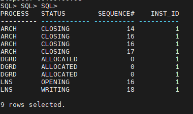
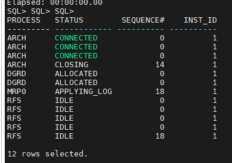

---
ShareButtons:
- linkedin
- whatsapp
- twitter
ShowReadingTime: true
tags:
- database
- oracledb
date : '2025-01-07T09:41:14+07:00'
draft : false
title : 'Oracle Explanation about the GAP'
---

### Primary

### Secondary

===========

#### PROCESS: 

Ini menunjukkan jenis proses yang sedang berjalan pada sistem. Beberapa proses yang ada dalam output ini antara lain:

- **DGRD**: Data Guard (DG) Real-Time Apply (DGRD) process. 
Ini adalah proses yang berhubungan dengan penerapan data dari primary ke standby 
database dalam konfigurasi Oracle Data Guard.

- **ARCH**: Archive process. Ini adalah proses yang bertanggung jawab 
untuk mengarsipkan redo logs yang dibuat oleh database.

- **LNS**: Log Network Service. Proses ini bertanggung jawab untuk 
mengirimkan redo logs ke standby database dalam konfigurasi Data Guard.

===========
 

#### STATUS: 
Ini menunjukkan status dari proses tersebut:

- **ALLOCATED**: Menandakan bahwa proses sudah dialokasikan, 
namun belum aktif melakukan pekerjaan tertentu.

- **CLOSING**: Status ini menunjukkan bahwa proses ARCH sedang 
menutup atau menyelesaikan pekerjaan pengarsipan redo log.

- **WRITING**: Proses LNS sedang menulis atau mengirimkan redo log ke standby.

- **CONNECTED**: Proses LNS terhubung dengan database, siap untuk mengirimkan redo logs.

- **CLIENT_P**: Ini menunjukkan klien yang terkait dengan proses tersebut. 
Sebagian besar kolom ini menunjukkan N/A, yang berarti tidak ada klien 
tertentu yang terkait dengan proses tersebut dalam konteks ini. Misalnya, pada baris
 yang berisi LNS dengan status "CONNECTED", itu menunjukkan proses LNS telah terhubung dengan standby database.

===========
 

#### SEQUENCE#: 
Ini adalah nomor urut redo log yang sedang diproses. Misalnya:

ARCH menunjukkan bahwa proses tersebut sedang mengarsipkan redo log dengan sequence# tertentu, misalnya 28670, 28671, dst.
LNS menunjukkan nomor sequence redo log yang sedang dikirimkan ke standby.

- **BLOCK#**: Ini adalah blok data dalam redo log yang sedang diproses. Ini memberikan informasi lebih lanjut mengenai lokasi atau posisi dalam file redo log. Misalnya:
Pada ARCH, blok 743424 menunjukkan lokasi tertentu dalam file redo log.

- **ACTIVE_AGENTS**: Ini menunjukkan jumlah agen aktif yang terkait dengan proses ini. Semua nilai di kolom ini adalah 0, yang mungkin menunjukkan bahwa tidak ada agen lain yang terkait atau aktif dalam proses ini.

- **KNOWN_AGENTS**: Ini menunjukkan jumlah agen yang dikenal oleh proses tersebut. Sama seperti kolom ACTIVE_AGENTS, semua nilai di kolom ini adalah 0, yang mungkin menunjukkan tidak ada agen lain yang terhubung atau diidentifikasi.