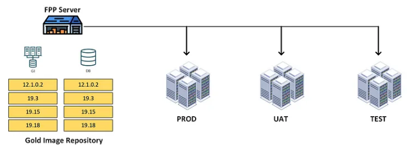

---
ShareButtons:
- linkedin
- whatsapp
- twitter
ShowReadingTime: true
draft: false
tags:
- database
- oracledb
date :  '2024-12-09T13:21:21+07:00'
title : 'Oracle Fleet Patching & Provisioning (FPP): Configuring FPP Server 19c'
---


### How Oracle Fleet Patching and Provisioning helps

Oracle FPP provides a tool capable of patching and upgrading Oracle Grid Infrastructure and Oracle Database using gold image. Gold image is a compressed copy of a software-only Oracle Database home or Grid Infrastructure home.

Oracle FPP server acts like a warehouse of various version of gold image that can be used to patching and upgrading. The image below describes a FPP server with GI and DB gold images:




### Prerequisite

- FPP Server Installation: Install and configure the FPP server on a supported OS.
- Network Configuration: 
	* Ensure the FPP server can communicate with all target nodes (open required ports).
	* required by FPP (default 3389) are open between the FPP server and targets.
- Oracle Home Compatibility: FPP supports patching Oracle databases from version 12.2 and above.
- Required Software: Install FPP Client on target servers and ensure OPatch is updated.
- Storage Configuration: Allocate sufficient space for the FPP working area (minimum 100 GB is recommended)
- Patching Images: Create Gold Images (software baselines) for patch deployment.
- User Privileges: 
	* Ensure SSH access and appropriate privileges for the FPP server to communicate with and apply patches to the targets.
	* A privileged account (like root or grid for Grid Infrastructure) 
- Validation and Testing:
- Backup and Recovery 
- Licensing : Verify that your Oracle licensing agreements cover the use of Fleet Patching and Provisioning
- Documentation


### Setup RHP Server

1. login as root, setup gns (Optional)

    ```go
    srvctl add gns -vip myhost-gnsvip3
    srvctl start gns
    srvctl status gns
    ```

2. As user grid, run mdbutil to create management database:

    ```go
    ./mdbutil.pl --addmdb --target=+ASMDATA1
    ```

    check log:

    ```go
    tail -1000f /dbi/oracle/V19BaseGrid/diag/rdbms/_mgmtdb/-MGMTDB/trace
    ```

    u can download ./mdbutil in here [MDBUtil: GI Management Repository configuration tool (Doc ID 2065175.1)](https://support.oracle.com/epmos/faces/DocumentDisplay?id=2065175.1&parent=EXTERNAL_SEARCH).

3. As user root, run the command bellow to remove any existing rhpserver:

    ```go
    /u01/app/19.0.0/grid/bin/srvctl remove rhpserver
    ```

4. As user root, run the command bellow to configure rhpserver. In this example, diskgroup +ASMDATA1 is my rhp storage location.

    ```go
    /u01/app/19.0.0/grid/bin/srvctl add rhpserver -storage /rhp_storage -diskgroup ASMDATA1
    ```

5. As user grid, run the command below to check rhpserver status:
    the result should be like this:
    ```go
    Rapid Home Provisioning Server is enabled
    Rapid Home Provisioning Server is not running

    srvctl status rhpserver
    ```


6. As user grid, start rhpserver

    ```go
    srvctl start rhpserver
    ```


### Import image

1. we import the Oracle Home, Grid Home into FPP server.

    ```go
    rhpctl import image -image [image name] -path [path to Oracle Home] -targetnode [target hostname] -root
    ```
    The image below is an example of importing image. The FPP server imports Oracle Home from Oracle instance in node xxxx.

    ex:
    ```go	
    rhpctl import image -image gridhome_1903.zip -path /dbi/oracle/V19Grid -targetnode db1 -root
    ```


### step patching (db or rollback, grid)
after create gold image now, step patching (db or rollback, grid)


#### step path db:

1. Create working copy:

    ```go
    rhpctl add workingcopy -image DB1918 -workingcopy WC_db_new19_18 \
    -storagetype LOCAL -user oracle -oraclebase /u01/app/oracle \
    -targetnode vnoradev07 -path /u01/app/oracle/product/19.18.0/dbhome_1 \
    -root
    ```
2. Run patching evaluation:

    ```go
    rhpctl move database -sourcehome /u01/app/oracle/product/19.0.0/dbhome_1 \
    -patchedwc WC_db_new19_18 -dbname oltp -targetnode vnoradev07 \
    -eval -root
    ```

3. Run patching:

    ```go
    rhpctl move database -sourcehome /u01/app/oracle/product/19.0.0/dbhome_1 \
    -patchedwc WC_db_new19_18 -dbname oltp -targetnode vnoradev07 \
    -root	
    ```

#### Rollback : in case wanna rollback

1. Create working copy

    ```go
    rhpctl add workingcopy -image dbhome_19_15 -workingcopy WC_db_home19_15 \
    -storagetype LOCAL -user oracle -oraclebase /u01/app/oracle \
    -targetnode vnoradev07 -path /u01/app/oracle/product/19.15.0/dbhome_1 \
    -root
    ```

2. Evaluate

    ```go
    rhpctl move database -sourcewc WC_db_new19_18 \
    -patchedwc WC_db_home19_15 -dbname oltp -targetnode vnoradev07 \
    -ignorewcpatches -eval -root
    ```

3. Rollback

    ```go
    rhpctl move database -sourcewc WC_db_new19_18 \
    -patchedwc WC_db_home19_15 -dbname oltp -targetnode vnoradev07 \
    -ignorewcpatches -root
    ```	


#### Patching GRID


1. Import image

    ```go
    rhpctl import image -image grid_19_18 \
    -zip /u04/ORACLE_GOLD_IMGAGE/grid_home_19.18.zip \
    -imagetype ORACLEGISOFTWARE
    ```	

2. Add working copy

    ```go
    rhpctl add workingcopy -image grid_19_18 -workingcopy WC_grid_home19_18 \
    -storagetype LOCAL -oraclebase /u01/app/grid \
    -targetnode vnoradev07 -path /u01/app/19.18.0/grid \
    -root -softwareonly
    ```
  
3. Patching evaluation

    ```go
    rhpctl move gihome -sourcehome /u01/app/19.0.0/grid \
    -destwc WC_grid_home19_18 -targetnode vnoradev07 \
    -eval -root
    ```

4. Patching

    ```go
    rhpctl move gihome -sourcehome /u01/app/19.0.0/grid \
    -destwc WC_grid_home19_18 -targetnode vnoradev07 \
    -root
    ```
		
		


### Throubeshoot


1. make ASMDATA using sqlplus

    ```go
    sqlplus / as sysasm
    CREATE DISKGROUP FPP_REPO EXTERNAL REDUNDANCY
    DISK '/dev/oracleasm/disks/ASMDATA1'
    ATTRIBUTE
    'AU_SIZE' = '4M' ,
    'COMPATIBLE.ASM' = '19.0' ,
    'COMPATIBLE.ADVM' = '19.0' ;
    ```


2. Error because cant read ASM so need makesure OS is CHK not UEK

    ```go
    [root@db1 bin]# ./srvctl add rhpserver -storage /rhp_storage -diskgroup ASMDATA1
    PRCG-1307 : Oracle ASM Dynamic Volume Manager compatibility check failed.
    PRCT-1431 : The Oracle ASM Dynamic Volume Manager compatibility attribute is not set for disk group ASMDATA1.
    ```


### All Simple step

```go
setup RHPSERVER:

#as grid, setup gns
srvctl add gns -vip myhost-gnsvip3
srvctl start gns
srvctl status gns


#as grid, add location for repository image
asmcmd lsdg
./mdbutil.pl --addmdb --target=+ASMDATA2


# as root, start rhp server
/srvctl remove rhpserver
/srvctl add rhpserver -storage /rhp_storage -diskgroup ASMDATA2
/srvctl start rhpserver
/srvctl status rhpserver


#Create image for repository
#makesure connection between node
#check telnet, ssh , port

#as grid,
rhpctl import image -image dbhome_19_24 -path /u01/app/oracle/product/12.2.0/dbhome_1 -targetnode db1 -root

```


		
Reference:
- https://docs.oracle.com/en/database/oracle/oracle-database/21/config_fpp_server/index.html#objectives
- https://blogs.oracle.com/maa/post/fpp-by-example-part-2-fpp-server-installation
- https://medium.com/@ductran2306/oracle-fleet-patching-and-provisioning-7950bc9a2a0b
- https://www.ludovicocaldara.net/dba/gi18c-patching-part2/
- https://dibiei.blog/2021/07/08/oracle-fleet-patching-provisioning-fpp-configuracao-do-fpp-server-19c/
- http://www.koreaoug.org/install/8737
- https://emilianofusaglia.net/tag/create-mgmtdb/


